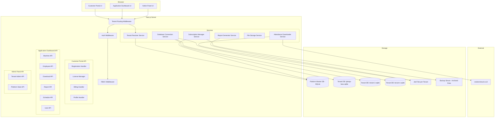
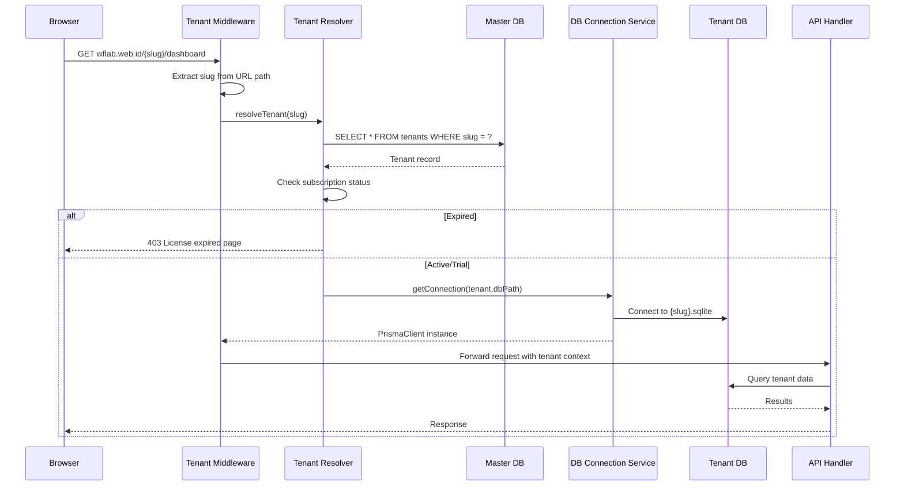
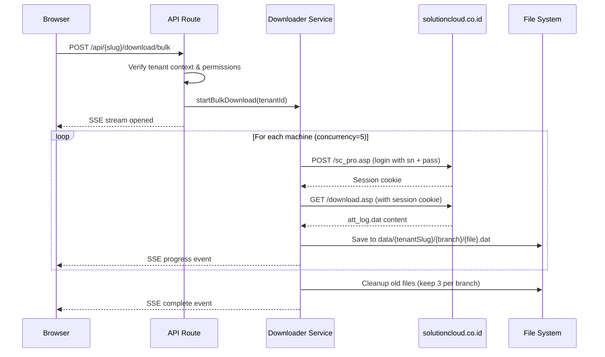
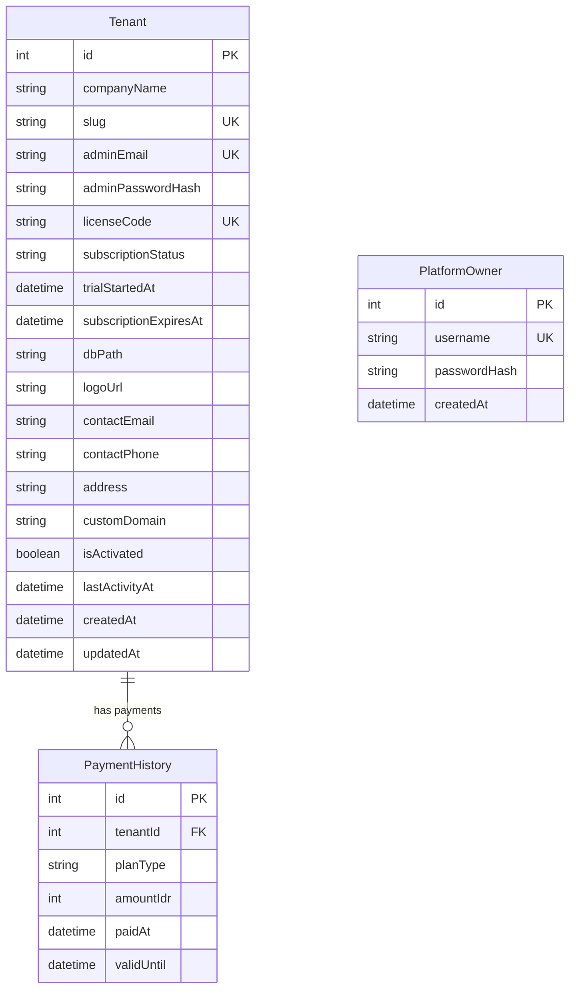
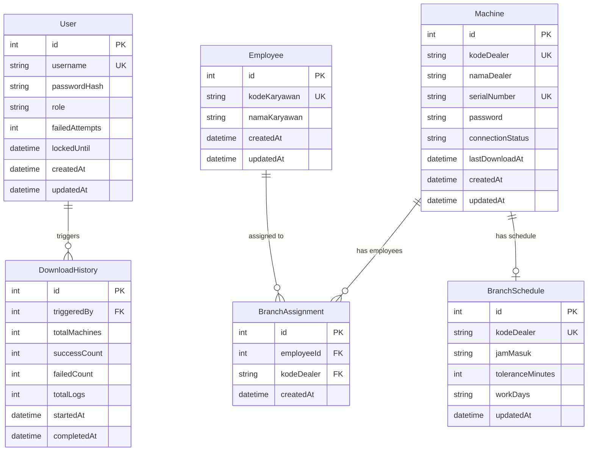

# Design Document: Web UI Absensi (Multi-Tenant SaaS)

## Overview

Web UI Absensi adalah platform SaaS multi-tenant yang dihosting di **wflab.web.id** untuk manajemen absensi berbasis fingerprint. Platform ini memungkinkan perusahaan manapun mendaftar, mendapatkan license code, dan mengaktifkan dashboard absensi mereka sendiri. Setiap tenant memiliki database SQLite terpisah untuk isolasi data penuh.

### Platform Architecture

Platform terdiri dari **tiga portal terpisah**:

1. **Customer Portal** (`wflab.web.id/`) — Registrasi tenant, billing, manajemen lisensi, profil perusahaan
2. **Application Dashboard** (`wflab.web.id/{tenant-slug}/`) — Aplikasi absensi per tenant (mesin, karyawan, download, laporan)
3. **Platform Owner Admin** (`wflab.web.id/admin/`) — Panel admin untuk mengelola semua tenant

### Key Design Decisions

1. **Path-based multi-tenant routing** (bukan subdomain): Lebih sederhana untuk SSL, DNS, dan deployment. URL pattern: `wflab.web.id/{slug}/`
2. **Database per tenant (SQLite)**: Setiap tenant mendapat file `.sqlite` terpisah untuk isolasi data penuh dan kemudahan backup/restore
3. **Next.js App Router + Prisma**: Monorepo full-stack dengan dynamic database connections per request
4. **License code activation**: Tenant mendaftar → dapat license code → aktivasi dashboard dengan code tersebut
5. **Tenant routing middleware**: Extracts slug dari URL path, resolves tenant, connects ke database yang benar
6. **Server-Sent Events (SSE)**: Real-time progress update saat bulk download
7. **iron-session**: Encrypted cookies untuk auth, stateless, tenant-aware

### Technology Stack

| Layer | Technology | Rationale |
|-------|-----------|-----------|
| Frontend | Next.js 14 (App Router) + React | SSR, file-based routing, API routes built-in |
| UI Components | shadcn/ui + Tailwind CSS | Accessible, customizable, no vendor lock-in |
| Backend API | Next.js Route Handlers | Co-located with frontend, no separate server |
| Database | SQLite + Prisma ORM | Zero-config, file-based, one DB per tenant |
| Platform DB | SQLite (single) | Master database for tenant registry & billing |
| Auth | iron-session | Encrypted cookies, stateless, tenant-aware |
| HTTP Client | axios | Already used in existing CLI tool |
| Excel Export | exceljs | Full .xlsx support with styling |
| PDF Export | pdfmake | Client-side PDF generation |
| Validation | zod | Runtime type validation, schema-first |
| Password Hashing | bcrypt | Industry standard, configurable rounds |

### Subscription Lifecycle

```
Registration → Free Trial (14 days) → Active (paid)
                                         ↓
                              7-day warning before expiry
                                         ↓
                              Expired (blocked immediately)
                                         ↓
                              7 days after expired → Data archived to backup
                                         ↓
                              Platform Owner can restore archived data
```

## Architecture

### System Architecture Diagram



### Tenant Routing Flow



### Bulk Download Flow



### Directory Structure

```
web-ui-absensi/
├── prisma/
│   ├── schema-master.prisma          # Platform master DB schema
│   ├── schema-tenant.prisma          # Per-tenant DB schema
│   ├── seed-master.ts                # Seed platform owner account
│   └── seed-tenant-tjahaja.ts        # Seed first tenant from Excel
├── src/
│   ├── app/
│   │   ├── (portal)/                 # Customer Portal routes
│   │   │   ├── page.tsx              # Landing / Login
│   │   │   ├── register/page.tsx     # Tenant registration
│   │   │   ├── portal/
│   │   │   │   ├── layout.tsx
│   │   │   │   ├── page.tsx          # Portal dashboard (license, billing)
│   │   │   │   ├── profile/page.tsx  # Company profile settings
│   │   │   │   ├── billing/page.tsx  # Subscription management
│   │   │   │   └── domain/page.tsx   # Custom domain settings
│   │   │   └── activate/page.tsx     # License activation page
│   │   ├── admin/                    # Platform Owner Admin
│   │   │   ├── layout.tsx
│   │   │   ├── page.tsx              # Admin dashboard
│   │   │   ├── tenants/page.tsx      # Tenant list & management
│   │   │   └── tenants/[id]/page.tsx # Tenant detail
│   │   ├── [slug]/                   # Tenant Application Dashboard
│   │   │   ├── (auth)/
│   │   │   │   └── login/page.tsx
│   │   │   ├── (dashboard)/
│   │   │   │   ├── layout.tsx
│   │   │   │   ├── page.tsx          # Tenant dashboard
│   │   │   │   ├── machines/page.tsx
│   │   │   │   ├── employees/page.tsx
│   │   │   │   ├── users/page.tsx
│   │   │   │   ├── download/page.tsx
│   │   │   │   ├── reports/page.tsx
│   │   │   │   └── settings/page.tsx # Branch schedule
│   │   │   └── activate/page.tsx     # License code entry
│   │   ├── api/
│   │   │   ├── portal/              # Customer Portal APIs
│   │   │   │   ├── register/route.ts
│   │   │   │   ├── license/route.ts
│   │   │   │   ├── billing/route.ts
│   │   │   │   ├── profile/route.ts
│   │   │   │   └── domain/route.ts
│   │   │   ├── admin/               # Platform Owner APIs
│   │   │   │   ├── tenants/route.ts
│   │   │   │   ├── tenants/[id]/route.ts
│   │   │   │   ├── tenants/[id]/suspend/route.ts
│   │   │   │   ├── tenants/[id]/activate/route.ts
│   │   │   │   └── stats/route.ts
│   │   │   └── [slug]/              # Tenant Application APIs
│   │   │       ├── auth/[...route]/route.ts
│   │   │       ├── users/route.ts
│   │   │       ├── machines/route.ts
│   │   │       ├── employees/route.ts
│   │   │       ├── employees/import/route.ts
│   │   │       ├── download/bulk/route.ts
│   │   │       ├── reports/route.ts
│   │   │       ├── reports/export/xlsx/route.ts
│   │   │       ├── reports/export/pdf/route.ts
│   │   │       └── settings/schedule/route.ts
│   │   └── layout.tsx
│   ├── lib/
│   │   ├── auth.ts                   # Session config (tenant-aware)
│   │   ├── db-master.ts             # Master DB Prisma client
│   │   ├── db-tenant.ts             # Dynamic tenant DB connections
│   │   ├── tenant-resolver.ts       # Slug → tenant resolution
│   │   ├── rbac.ts                  # Role permissions
│   │   ├── subscription.ts          # License/subscription logic
│   │   └── validation.ts            # Zod schemas
│   ├── middleware.ts                 # Next.js middleware (tenant routing)
│   ├── services/
│   │   ├── attendance-downloader.ts
│   │   ├── report-generator.ts
│   │   ├── file-storage.ts
│   │   ├── employee-import.ts
│   │   └── subscription-manager.ts
│   ├── components/
│   │   ├── ui/                       # shadcn components
│   │   ├── portal/                   # Customer portal components
│   │   ├── admin/                    # Admin panel components
│   │   ├── layout/
│   │   │   ├── sidebar.tsx
│   │   │   └── header.tsx            # Shows tenant logo/name
│   │   ├── machines/
│   │   ├── employees/
│   │   ├── users/
│   │   ├── download/
│   │   └── reports/
│   └── types/
│       └── index.ts
├── data/                             # .dat file storage per tenant
│   └── {tenant-slug}/
│       └── {branch-name}/
├── databases/                        # Tenant SQLite files
│   ├── master.sqlite                 # Platform master DB
│   └── tenants/
│       ├── tjahaja-baru.sqlite
│       └── {slug}.sqlite
├── backups/                          # Archived tenant data
├── next.config.js
├── tailwind.config.ts
└── package.json
```

## Components and Interfaces

### Tenant Resolver Service

```typescript
// src/lib/tenant-resolver.ts
interface TenantInfo {
  id: number;
  companyName: string;
  slug: string;
  dbPath: string;           // Path to tenant's SQLite file
  licenseCode: string;
  subscriptionStatus: 'trial' | 'active' | 'expiring_soon' | 'expired' | 'suspended' | 'archived';
  expiresAt: Date;
  isActivated: boolean;
  logoUrl: string | null;
  customDomain: string | null;
}

interface TenantResolverService {
  resolveBySlug(slug: string): Promise<TenantInfo | null>;
  resolveByCustomDomain(domain: string): Promise<TenantInfo | null>;
  isSlugReserved(slug: string): boolean;  // "admin" is reserved
  validateSlug(slug: string): boolean;
}
```

### Database Connection Service

```typescript
// src/lib/db-tenant.ts
import { PrismaClient } from '@prisma/client';

interface DatabaseConnectionService {
  /** Get or create a PrismaClient for a specific tenant */
  getConnection(tenantSlug: string): Promise<PrismaClient>;
  
  /** Provision a new SQLite database for a tenant */
  provisionDatabase(tenantSlug: string): Promise<string>;
  
  /** Archive tenant database to backup location */
  archiveDatabase(tenantSlug: string): Promise<void>;
  
  /** Restore archived database */
  restoreDatabase(tenantSlug: string): Promise<void>;
  
  /** Close and cleanup connection */
  closeConnection(tenantSlug: string): Promise<void>;
}

// Connection pool with LRU eviction for tenant databases
const connectionPool = new Map<string, { client: PrismaClient; lastUsed: number }>();
const MAX_CONNECTIONS = 20;
```

### Subscription Manager Service

```typescript
// src/services/subscription-manager.ts
interface SubscriptionPlan {
  type: 'monthly' | 'yearly';
  priceIdr: number;         // 35000 for monthly
  durationDays: number;     // 30 or 365
}

interface SubscriptionManagerService {
  /** Create free trial for new tenant (14 days) */
  createTrial(tenantId: number): Promise<void>;
  
  /** Check and update subscription status */
  checkStatus(tenantId: number): Promise<SubscriptionStatus>;
  
  /** Extend subscription after payment */
  extendSubscription(tenantId: number, plan: SubscriptionPlan): Promise<void>;
  
  /** Get days remaining */
  getDaysRemaining(tenantId: number): Promise<number>;
  
  /** Check if warning should be shown (< 7 days) */
  shouldShowWarning(tenantId: number): Promise<boolean>;
  
  /** Archive expired tenant data (7 days after expiry) */
  archiveExpiredTenant(tenantId: number): Promise<void>;
  
  /** Restore archived tenant */
  restoreTenant(tenantId: number, newLicenseCode: string): Promise<void>;
  
  /** Generate unique license code */
  generateLicenseCode(): string;
  
  /** Regenerate license code for tenant */
  regenerateLicenseCode(tenantId: number): Promise<string>;
}

type SubscriptionStatus = 'trial' | 'active' | 'expiring_soon' | 'expired' | 'suspended' | 'archived';
```

### Authentication Module (Tenant-Aware)

```typescript
// src/lib/auth.ts
interface SessionData {
  // Portal session (customer portal)
  portalTenantId?: number;
  portalEmail?: string;
  
  // Tenant app session
  tenantSlug?: string;
  userId?: number;
  username?: string;
  role?: 'Superadmin' | 'HRD' | 'Resepsionis';
  
  // Platform owner session
  isOwner?: boolean;
  
  loginAt: number;
}

interface AuthService {
  // Tenant app auth
  loginTenantUser(tenantSlug: string, username: string, password: string): Promise<SessionData | null>;
  
  // Portal auth
  loginPortalUser(email: string, password: string): Promise<SessionData | null>;
  
  // Platform owner auth
  loginOwner(username: string, password: string): Promise<SessionData | null>;
  
  logout(): Promise<void>;
  getSession(): Promise<SessionData | null>;
  incrementFailedAttempts(tenantSlug: string, username: string): Promise<number>;
  isAccountLocked(tenantSlug: string, username: string): Promise<boolean>;
  resetFailedAttempts(tenantSlug: string, username: string): Promise<void>;
}
```

### RBAC Module

```typescript
// src/lib/rbac.ts
type TenantRole = 'Superadmin' | 'HRD' | 'Resepsionis';
type Feature = 'user-management' | 'machine-management' | 'employee-management' 
             | 'bulk-download' | 'report' | 'dashboard' | 'branch-schedule'
             | 'company-profile' | 'domain-settings';

const ROLE_PERMISSIONS: Record<TenantRole, Feature[]> = {
  Superadmin: ['user-management', 'machine-management', 'employee-management', 
               'bulk-download', 'report', 'dashboard', 'branch-schedule',
               'company-profile', 'domain-settings'],
  HRD: ['employee-management', 'bulk-download', 'report', 'dashboard'],
  Resepsionis: ['report', 'dashboard'],
};

function hasPermission(role: TenantRole, feature: Feature): boolean;
function requireRole(allowedRoles: TenantRole[]): MiddlewareFunction;
function requireOwner(): MiddlewareFunction;
function requirePortalAuth(): MiddlewareFunction;
```

### Registration & License Service

```typescript
// src/services/registration.ts
interface RegistrationInput {
  companyName: string;
  companySlug: string;       // lowercase, hyphens, 3-30 chars
  adminEmail: string;
  adminUsername: string;     // 3-30 alphanumeric
  adminPassword: string;    // 8-128 chars
}

interface RegistrationResult {
  tenantId: number;
  slug: string;
  licenseCode: string;
  trialExpiresAt: Date;
}

interface RegistrationService {
  register(input: RegistrationInput): Promise<RegistrationResult>;
  activateDashboard(slug: string, licenseCode: string): Promise<boolean>;
  validateSlug(slug: string): { valid: boolean; error?: string };
}
```

### Attendance Downloader Service

```typescript
// src/services/attendance-downloader.ts
interface DownloadProgress {
  machineId: number;
  kodeDealer: string;
  namaDealer: string;
  status: 'processing' | 'success' | 'failed';
  error?: string;
  logsCount?: number;
}

interface BulkDownloadResult {
  totalMachines: number;
  successCount: number;
  failedCount: number;
  totalLogs: number;
  startedAt: Date;
  completedAt: Date;
}

interface AttendanceDownloaderService {
  startBulkDownload(
    tenantSlug: string,
    onProgress: (progress: DownloadProgress) => void
  ): Promise<BulkDownloadResult>;
  
  downloadSingleMachine(tenantSlug: string, machine: Machine): Promise<{
    success: boolean;
    logsCount: number;
    error?: string;
  }>;
  
  isDownloadInProgress(tenantSlug: string): boolean;
}

// Login to solutioncloud: POST http://solutioncloud.co.id/sc_pro.asp
// Fields: "sn" (serial number), "pass" (password)
// Download: GET http://solutioncloud.co.id/download.asp with session cookie
// att_log.dat format: tab-separated, ~11 columns
// Data is cumulative per machine
```

### Report Generator Service

```typescript
// src/services/report-generator.ts
interface AttendanceRecord {
  kodeDealer: string;
  namaDealer: string;
  tanggal: string;        // YYYY-MM-DD
  kodeKaryawan: string;
  namaKaryawan: string;
  jamMasuk: string | null;
  jamPulang: string | null;
  totalTap: number;
  status: 'Tepat Waktu' | 'Telat' | 'Tidak Masuk';
}

interface ReportFilter {
  startDate: string;      // YYYY-MM-DD
  endDate: string;        // YYYY-MM-DD
  kodeDealer?: string;
}

interface ReportGeneratorService {
  generateReport(tenantSlug: string, filter: ReportFilter): Promise<AttendanceRecord[]>;
  exportToExcel(records: AttendanceRecord[], tenantInfo: TenantInfo): Promise<Buffer>;
  exportToPdf(records: AttendanceRecord[], tenantInfo: TenantInfo): Promise<Buffer>;
  parseAttLogFile(filePath: string): AttLogEntry[];
  determineStatus(
    jamMasuk: string | null,
    scheduleJamMasuk: string,
    toleranceMinutes: number
  ): 'Tepat Waktu' | 'Telat' | 'Tidak Masuk';
}

interface AttLogEntry {
  id: string;             // Employee fingerprint code
  datetime: Date;         // YYYY-MM-DD HH:MM:SS
  status1: number;
  status2: number;
  status3: number;
}
```

### File Storage Service (Tenant-Isolated)

```typescript
// src/services/file-storage.ts
interface FileStorageService {
  /** Save att_log.dat file in tenant-isolated directory */
  saveAttLogFile(tenantSlug: string, namaDealer: string, content: string): Promise<string>;
  getLatestFile(tenantSlug: string, namaDealer: string): Promise<string | null>;
  cleanupOldFiles(tenantSlug: string, namaDealer: string, keepCount: number): Promise<number>;
  listFiles(tenantSlug: string, namaDealer: string): Promise<string[]>;
  
  /** Archive all tenant files to backup */
  archiveTenantFiles(tenantSlug: string): Promise<void>;
  restoreTenantFiles(tenantSlug: string): Promise<void>;
}

// File path pattern: data/{tenantSlug}/{namaDealer}/{namaDealer}-{DD}-{MM}-{YYYY}.dat
```

### Employee Import Service

```typescript
// src/services/employee-import.ts
interface ImportResult {
  totalRows: number;
  successCount: number;
  skippedCount: number;   // duplicates
  failedCount: number;    // invalid data
  errors: Array<{ row: number; reason: string }>;
}

interface EmployeeImportService {
  importFromExcel(
    tenantSlug: string,
    fileBuffer: Buffer, 
    kodeDealer: string
  ): Promise<ImportResult>;
  
  validateRow(row: unknown[]): { valid: boolean; error?: string };
}
```

### Platform Owner Admin Service

```typescript
// src/services/platform-admin.ts
interface TenantSummary {
  id: number;
  companyName: string;
  slug: string;
  registrationDate: Date;
  subscriptionStatus: SubscriptionStatus;
  lastActivityDate: Date;
  machineCount: number;
  employeeCount: number;
  userCount: number;
}

interface PlatformStats {
  totalTenants: number;
  activeSubscriptions: number;
  trialsExpiringSoon: number;
  totalPlatformUsage: {
    totalMachines: number;
    totalEmployees: number;
    totalDownloads: number;
  };
}

interface PlatformAdminService {
  listTenants(): Promise<TenantSummary[]>;
  getTenantDetail(tenantId: number): Promise<TenantSummary & { downloadHistory: any[] }>;
  suspendTenant(tenantId: number): Promise<void>;
  activateTenant(tenantId: number, durationDays: number): Promise<void>;
  getStats(): Promise<PlatformStats>;
  restoreArchivedTenant(tenantId: number): Promise<void>;
}
```

### API Endpoints Summary

#### Customer Portal APIs (`/api/portal/`)

| Method | Path | Auth | Description |
|--------|------|------|-------------|
| POST | /api/portal/register | Public | Register new tenant |
| POST | /api/portal/login | Public | Portal login |
| GET | /api/portal/license | Portal Auth | View license info |
| POST | /api/portal/license/regenerate | Portal Auth | Regenerate license code |
| GET | /api/portal/billing | Portal Auth | View subscription status |
| POST | /api/portal/billing/subscribe | Portal Auth | Subscribe to plan |
| GET | /api/portal/profile | Portal Auth | View company profile |
| PUT | /api/portal/profile | Portal Auth | Update company profile |
| POST | /api/portal/profile/logo | Portal Auth | Upload company logo |
| GET | /api/portal/domain | Portal Auth | View domain settings |
| POST | /api/portal/domain | Portal Auth | Add custom domain |

#### Platform Owner Admin APIs (`/api/admin/`)

| Method | Path | Auth | Description |
|--------|------|------|-------------|
| POST | /api/admin/login | Public | Owner login |
| GET | /api/admin/tenants | Owner | List all tenants |
| GET | /api/admin/tenants/[id] | Owner | Tenant detail |
| POST | /api/admin/tenants/[id]/suspend | Owner | Suspend tenant |
| POST | /api/admin/tenants/[id]/activate | Owner | Activate/extend subscription |
| POST | /api/admin/tenants/[id]/restore | Owner | Restore archived tenant |
| GET | /api/admin/stats | Owner | Platform statistics |

#### Tenant Application APIs (`/api/[slug]/`)

| Method | Path | Auth | Description |
|--------|------|------|-------------|
| POST | /api/[slug]/activate | Public | Activate with license code |
| POST | /api/[slug]/auth/login | Public | Tenant user login |
| POST | /api/[slug]/auth/logout | Any | Logout |
| GET | /api/[slug]/auth/session | Any | Get current session |
| GET | /api/[slug]/users | Superadmin | List users |
| POST | /api/[slug]/users | Superadmin | Create user |
| PUT | /api/[slug]/users/[id] | Superadmin | Update user |
| DELETE | /api/[slug]/users/[id] | Superadmin | Delete user |
| GET | /api/[slug]/machines | Superadmin | List machines |
| POST | /api/[slug]/machines | Superadmin | Create machine |
| PUT | /api/[slug]/machines/[id] | Superadmin | Update machine |
| DELETE | /api/[slug]/machines/[id] | Superadmin | Delete machine |
| GET | /api/[slug]/employees | Superadmin, HRD | List employees |
| POST | /api/[slug]/employees | Superadmin, HRD | Create employee |
| PUT | /api/[slug]/employees/[id] | Superadmin, HRD | Update employee |
| DELETE | /api/[slug]/employees/[id] | Superadmin, HRD | Delete employee |
| POST | /api/[slug]/employees/import | Superadmin, HRD | Bulk import |
| POST | /api/[slug]/download/bulk | Superadmin, HRD | Start bulk download (SSE) |
| GET | /api/[slug]/download/status | Superadmin, HRD | Check download status |
| GET | /api/[slug]/reports | Any | Get attendance report |
| GET | /api/[slug]/reports/export/xlsx | Any | Export to Excel |
| GET | /api/[slug]/reports/export/pdf | Any | Export to PDF |
| GET | /api/[slug]/settings/schedule | Superadmin | List branch schedules |
| PUT | /api/[slug]/settings/schedule/[id] | Superadmin | Update branch schedule |
| GET | /api/[slug]/dashboard | Any | Dashboard stats |

## Data Models

### Master Database (Platform-Level)



### Tenant Database (Per-Tenant, Isolated)



### Prisma Schema — Master Database

```prisma
// prisma/schema-master.prisma
datasource db {
  provider = "sqlite"
  url      = "file:../databases/master.sqlite"
}

generator client {
  provider = "prisma-client-js"
  output   = "../src/generated/master"
}

model Tenant {
  id                    Int       @id @default(autoincrement())
  companyName           String
  slug                  String    @unique
  adminEmail            String    @unique
  adminPasswordHash     String
  licenseCode           String    @unique
  subscriptionStatus    String    @default("trial") // trial|active|expiring_soon|expired|suspended|archived
  trialStartedAt        DateTime  @default(now())
  subscriptionExpiresAt DateTime
  dbPath                String    // relative path to tenant SQLite file
  logoUrl               String?
  contactEmail          String?
  contactPhone          String?
  address               String?
  customDomain          String?   @unique
  isActivated           Boolean   @default(false)
  lastActivityAt        DateTime  @default(now())
  createdAt             DateTime  @default(now())
  updatedAt             DateTime  @updatedAt
  payments              PaymentHistory[]
}

model PlatformOwner {
  id           Int      @id @default(autoincrement())
  username     String   @unique
  passwordHash String
  createdAt    DateTime @default(now())
}

model PaymentHistory {
  id         Int      @id @default(autoincrement())
  tenantId   Int
  planType   String   // 'monthly' | 'yearly'
  amountIdr  Int
  paidAt     DateTime @default(now())
  validUntil DateTime
  tenant     Tenant   @relation(fields: [tenantId], references: [id])
}
```

### Prisma Schema — Tenant Database

```prisma
// prisma/schema-tenant.prisma
datasource db {
  provider = "sqlite"
  url      = env("TENANT_DATABASE_URL")  // Dynamically set per request
}

generator client {
  provider = "prisma-client-js"
  output   = "../src/generated/tenant"
}

model User {
  id              Int       @id @default(autoincrement())
  username        String    @unique
  passwordHash    String
  role            String    // 'Superadmin' | 'HRD' | 'Resepsionis'
  failedAttempts  Int       @default(0)
  lockedUntil     DateTime?
  createdAt       DateTime  @default(now())
  updatedAt       DateTime  @updatedAt
  downloadHistory DownloadHistory[]
}

model Machine {
  id               Int       @id @default(autoincrement())
  kodeDealer       String    @unique
  namaDealer       String
  serialNumber     String    @unique
  password         String
  connectionStatus String    @default("unknown")
  lastDownloadAt   DateTime?
  createdAt        DateTime  @default(now())
  updatedAt        DateTime  @updatedAt
  branchAssignments BranchAssignment[]
  branchSchedule   BranchSchedule?
}

model Employee {
  id              Int       @id @default(autoincrement())
  kodeKaryawan    String    @unique
  namaKaryawan    String
  createdAt       DateTime  @default(now())
  updatedAt       DateTime  @updatedAt
  branchAssignments BranchAssignment[]
}

model BranchAssignment {
  id          Int      @id @default(autoincrement())
  employeeId  Int
  kodeDealer  String
  createdAt   DateTime @default(now())
  employee    Employee @relation(fields: [employeeId], references: [id], onDelete: Cascade)
  machine     Machine  @relation(fields: [kodeDealer], references: [kodeDealer], onDelete: Cascade)

  @@unique([employeeId, kodeDealer])
}

model BranchSchedule {
  id               Int      @id @default(autoincrement())
  kodeDealer       String   @unique
  jamMasuk         String   @default("08:00")
  toleranceMinutes Int      @default(5)
  workDays         String   @default("1,2,3,4,5,6,7")
  updatedAt        DateTime @updatedAt
  machine          Machine  @relation(fields: [kodeDealer], references: [kodeDealer], onDelete: Cascade)
}

model DownloadHistory {
  id            Int      @id @default(autoincrement())
  triggeredById Int
  totalMachines Int
  successCount  Int
  failedCount   Int
  totalLogs     Int
  startedAt     DateTime
  completedAt   DateTime?
  triggeredBy   User     @relation(fields: [triggeredById], references: [id])
}
```

### Validation Schemas (Zod)

```typescript
// src/lib/validation.ts
import { z } from 'zod';

// === Portal Schemas ===
export const registrationSchema = z.object({
  companyName: z.string().min(3).max(100).trim(),
  companySlug: z.string().min(3).max(30).regex(/^[a-z0-9]+(-[a-z0-9]+)*$/,
    'Slug hanya boleh huruf kecil, angka, dan tanda hubung'),
  adminEmail: z.string().email().max(255),
  adminUsername: z.string().min(3).max(30).regex(/^[a-zA-Z0-9]+$/),
  adminPassword: z.string().min(8).max(128),
});

export const activateLicenseSchema = z.object({
  licenseCode: z.string().min(1),
});

export const companyProfileSchema = z.object({
  companyName: z.string().min(3).max(100).trim().optional(),
  contactEmail: z.string().email().max(255).optional(),
  contactPhone: z.string().max(20).optional(),
  address: z.string().max(500).optional(),
});

export const customDomainSchema = z.object({
  domain: z.string().min(4).max(255).regex(/^[a-z0-9]+([\-\.]{1}[a-z0-9]+)*\.[a-z]{2,}$/),
});

// === Tenant App Schemas ===
export const loginSchema = z.object({
  username: z.string().min(1).max(50),
  password: z.string().min(1).max(128),
});

export const createUserSchema = z.object({
  username: z.string().min(3).max(30).regex(/^[a-zA-Z0-9]+$/),
  password: z.string().min(8).max(128),
  role: z.enum(['Superadmin', 'HRD', 'Resepsionis']),
});

export const updateUserPasswordSchema = z.object({
  password: z.string().min(8).max(128),
});

export const updateUserRoleSchema = z.object({
  role: z.enum(['Superadmin', 'HRD', 'Resepsionis']),
});

export const createMachineSchema = z.object({
  kodeDealer: z.string().min(1).max(20).trim(),
  namaDealer: z.string().min(1).max(100).trim(),
  serialNumber: z.string().min(1).max(50).trim(),
  password: z.string().min(1).max(50).trim(),
});

export const createEmployeeSchema = z.object({
  kodeKaryawan: z.string().min(1).max(100).trim(),
  namaKaryawan: z.string().min(1).max(100).trim(),
  branches: z.array(z.string()).min(1),
});

export const reportFilterSchema = z.object({
  startDate: z.string().regex(/^\d{4}-\d{2}-\d{2}$/),
  endDate: z.string().regex(/^\d{4}-\d{2}-\d{2}$/),
  kodeDealer: z.string().optional(),
});

export const branchScheduleSchema = z.object({
  jamMasuk: z.string().regex(/^\d{2}:\d{2}$/),
  toleranceMinutes: z.number().int().min(0).max(60),
  workDays: z.array(z.number().int().min(1).max(7)).min(1),
});

// === Admin Schemas ===
export const suspendTenantSchema = z.object({
  reason: z.string().max(500).optional(),
});

export const activateTenantSchema = z.object({
  planType: z.enum(['monthly', 'yearly']),
  durationDays: z.number().int().min(1),
});
```

### Dynamic Database Connection Implementation

```typescript
// src/lib/db-tenant.ts
import { PrismaClient } from '../generated/tenant';
import path from 'path';

const connectionPool = new Map<string, { client: PrismaClient; lastUsed: number }>();
const MAX_POOL_SIZE = 20;
const IDLE_TIMEOUT_MS = 5 * 60 * 1000; // 5 minutes

export async function getTenantDb(tenantSlug: string): Promise<PrismaClient> {
  const existing = connectionPool.get(tenantSlug);
  if (existing) {
    existing.lastUsed = Date.now();
    return existing.client;
  }

  // Evict oldest if pool is full
  if (connectionPool.size >= MAX_POOL_SIZE) {
    let oldestKey = '';
    let oldestTime = Infinity;
    for (const [key, val] of connectionPool) {
      if (val.lastUsed < oldestTime) {
        oldestTime = val.lastUsed;
        oldestKey = key;
      }
    }
    if (oldestKey) {
      await connectionPool.get(oldestKey)?.client.$disconnect();
      connectionPool.delete(oldestKey);
    }
  }

  const dbPath = path.resolve(`databases/tenants/${tenantSlug}.sqlite`);
  const client = new PrismaClient({
    datasources: { db: { url: `file:${dbPath}` } },
  });
  await client.$connect();
  
  connectionPool.set(tenantSlug, { client, lastUsed: Date.now() });
  return client;
}
```

## Correctness Properties

*A property is a characteristic or behavior that should hold true across all valid executions of a system—essentially, a formal statement about what the system should do. Properties serve as the bridge between human-readable specifications and machine-verifiable correctness guarantees.*

### Property 1: Password hashing round-trip

*For any* valid password string (1–128 characters), hashing the password and then verifying the original password against the hash should return true, verifying a different password should return false, and the hash should never equal the plaintext password.

**Validates: Requirements 1.1, 1.2, 2.4, 2.8**

### Property 2: RBAC enforcement

*For any* combination of tenant user role (Superadmin, HRD, Resepsionis) and feature (user-management, machine-management, employee-management, bulk-download, report, dashboard, branch-schedule, company-profile, domain-settings), if the role does not include that feature in its permission set, then attempting to access that feature's API endpoint should return a 403 Forbidden response; if the role does include it, access should be granted.

**Validates: Requirements 2.9, 3.7, 4.11, 5.12, 6.13, 7.5, 9.1, 9.2, 9.3, 9.4, 11.5, 15.5**

### Property 3: Uniqueness constraint enforcement

*For any* entity (User username, Machine serialNumber, Machine kodeDealer, Employee kodeKaryawan, Tenant slug, Tenant adminEmail) where a unique field value already exists in the database, attempting to create a new record with the same unique field value should be rejected with an appropriate error message.

**Validates: Requirements 2.2, 3.5, 4.6, 10.6**

### Property 4: Whitespace and empty input rejection

*For any* required field in a machine or employee form that contains only whitespace characters or is empty, the submission should be rejected with a validation error indicating which field is invalid.

**Validates: Requirements 3.6, 4.7**

### Property 5: Employee list sorting invariant

*For any* set of employees returned by the employee list endpoint, the records should be sorted by kodeKaryawan in ascending lexicographic order.

**Validates: Requirements 4.2**

### Property 6: Employee branch filter correctness

*For any* branch filter (kodeDealer) applied to the employee list, every returned employee should have a BranchAssignment record matching that kodeDealer, and no employee without that assignment should appear in the results.

**Validates: Requirements 4.3**

### Property 7: Bulk operation summary consistency

*For any* bulk operation result (import or download), the total count should equal the sum of success count, skipped count (for imports), and failed count.

**Validates: Requirements 4.9, 5.9**

### Property 8: Bulk import duplicate skipping

*For any* Excel import file containing rows with kodeKaryawan values that already exist in the database, those rows should be skipped (not imported, not causing errors), and the skipped count should equal the number of duplicate rows.

**Validates: Requirements 4.10**

### Property 9: att_log.dat parsing round-trip

*For any* valid attendance log entry (ID, datetime, status fields), formatting it into the tab-separated att_log.dat format and then parsing it back should produce an equivalent entry with the same ID, datetime, and status values.

**Validates: Requirements 5.4**

### Property 10: File naming convention

*For any* valid namaDealer string and date, the generated filename should match the pattern `{namaDealer}-{DD}-{MM}-{YYYY}.dat` where DD, MM, YYYY correspond to the day, month, and year of the given date.

**Validates: Requirements 5.2**

### Property 11: File retention limit

*For any* branch folder after a save-and-cleanup operation, the number of .dat files should be at most 3, and the retained files should be the 3 most recent by date.

**Validates: Requirements 5.3**

### Property 12: Latest file selection

*For any* set of .dat files in a branch folder with different dates in their filenames, the file selected for processing should be the one with the most recent (latest) date.

**Validates: Requirements 5.5**

### Property 13: Attendance record tap time computation

*For any* set of tap timestamps for a single employee on a single date, jamMasuk should equal the earliest (minimum) timestamp, and jamPulang should equal the latest (maximum) timestamp if there are multiple taps, or null if there is exactly one tap.

**Validates: Requirements 6.2, 6.3**

### Property 14: Attendance status determination

*For any* employee attendance record: if jamMasuk is after (scheduleJamMasuk + toleranceMinutes), status should be "Telat"; if jamMasuk is at or before (scheduleJamMasuk + toleranceMinutes), status should be "Tepat Waktu"; if the employee has no tap on a configured work day, status should be "Tidak Masuk".

**Validates: Requirements 6.10, 6.11, 6.12**

### Property 15: Report sorting invariant

*For any* generated attendance report, the records should be sorted first by kodeDealer ascending, then by tanggal ascending, then by namaKaryawan ascending.

**Validates: Requirements 6.4**

### Property 16: Report filter correctness

*For any* date range and optional kodeDealer filter applied to the report, every returned record should have a tanggal within the specified date range (inclusive), and if kodeDealer is specified, every record should match that kodeDealer.

**Validates: Requirements 6.5**

### Property 17: Unmatched employee ID labeling

*For any* employee ID found in att_log.dat that does not match any kodeKaryawan in the Employee database, the corresponding report record should display "Tidak Ditemukan" as the namaKaryawan.

**Validates: Requirements 6.8**

### Property 18: Default schedule fallback

*For any* branch (kodeDealer) that has no custom BranchSchedule record in the database, the effective schedule used for attendance status calculation should be jamMasuk="08:00", toleranceMinutes=5, and workDays=Monday through Sunday.

**Validates: Requirements 7.6**

### Property 19: Registration input validation

*For any* registration input: if adminEmail is not a valid email format, or adminUsername is not 3-30 alphanumeric characters, or adminPassword is not 8-128 characters, or companySlug does not match lowercase letters/numbers/hyphens (3-30 chars), the registration should be rejected with a validation error. Conversely, if all fields are valid, registration should succeed.

**Validates: Requirements 10.7**

### Property 20: License code uniqueness

*For any* two distinct tenants created by the platform, their generated license codes should be different (no collisions).

**Validates: Requirements 10.2**

### Property 21: Tenant data isolation

*For any* two tenants A and B, all API requests scoped to tenant A's slug should only return data from tenant A's database, and should never return data from tenant B's database. Additionally, .dat files for tenant A should be stored in a directory separate from tenant B's files.

**Validates: Requirements 12.2, 12.3, 12.4, 12.5**

### Property 22: Subscription/suspension status enforcement

*For any* tenant whose subscription status is "expired" or "suspended", all requests to that tenant's application dashboard should be blocked with an appropriate error message. Access should only be restored when the status changes to "active" or "trial".

**Validates: Requirements 13.3, 14.6**

### Property 23: Trial days remaining calculation

*For any* tenant on free trial with a known trialStartedAt date, the remaining days should equal 14 minus the number of days elapsed since trialStartedAt (minimum 0).

**Validates: Requirements 14.2**

### Property 24: Custom domain and original URL dual access

*For any* tenant with a configured and verified custom domain, both the original path URL (wflab.web.id/{slug}/) and the custom domain should resolve to the same tenant and return the same data.

**Validates: Requirements 15.4**

## Error Handling

### Error Response Format

All API errors follow a consistent JSON structure:

```typescript
interface ApiError {
  error: {
    code: string;        // Machine-readable error code
    message: string;     // Human-readable message (Indonesian)
    field?: string;      // Optional: which field caused the error
  };
}
```

### Error Categories

| Category | HTTP Status | Code Pattern | Example |
|----------|-------------|--------------|---------|
| Validation | 400 | `VALIDATION_*` | `VALIDATION_EMPTY_FIELD` |
| Authentication | 401 | `AUTH_*` | `AUTH_INVALID_CREDENTIALS` |
| Authorization | 403 | `RBAC_*` | `RBAC_INSUFFICIENT_PERMISSION` |
| Tenant Not Found | 404 | `TENANT_*` | `TENANT_NOT_FOUND` |
| Not Found | 404 | `NOT_FOUND_*` | `NOT_FOUND_USER` |
| Conflict | 409 | `CONFLICT_*` | `CONFLICT_DUPLICATE_USERNAME` |
| License | 402 | `LICENSE_*` | `LICENSE_EXPIRED` |
| Rate Limit | 429 | `RATE_LIMIT_*` | `RATE_LIMIT_ACCOUNT_LOCKED` |
| Server Error | 500 | `SERVER_*` | `SERVER_INTERNAL_ERROR` |

### Specific Error Handling

1. **Tenant resolution failures**: If slug doesn't match any tenant, return 404 with `TENANT_NOT_FOUND`. If tenant is suspended/expired, return 402 with `LICENSE_EXPIRED` or 403 with `TENANT_SUSPENDED`.

2. **Cross-tenant access attempts**: If authenticated user's session belongs to tenant A but request targets tenant B, return 403 with `RBAC_CROSS_TENANT_ACCESS`. Never leak data from other tenants.

3. **Login failures**: Track consecutive failures per username per tenant. After 5 failures, lock for 15 minutes. Return generic "invalid credentials" to prevent username enumeration.

4. **External service failures (solutioncloud.co.id)**: 15-second timeout per machine. Mark individual machines as failed without stopping the batch. Update `connectionStatus` to "disconnected" on failure.

5. **File parsing errors**: If a .dat file is corrupted or has invalid format, log the error and skip invalid lines. Report partial results rather than failing entirely.

6. **Bulk import errors**: Process all rows regardless of individual failures. Collect errors per row and return summary. Never stop import due to a single invalid row.

7. **Database connection errors**: If tenant database file is missing or corrupted, return 500 with `SERVER_DATABASE_ERROR`. Log for platform owner investigation.

8. **Database provisioning errors**: If creating a new tenant database fails, rollback the master DB tenant record and return 500.

9. **Subscription lifecycle errors**: 
   - Archive job failure: Retry 3 times, then alert platform owner
   - Restore failure: Return error to platform owner with details

10. **Session errors**: On expired/invalid session, return 401 with redirect hint. Frontend middleware handles redirect to login page. Tenant context is preserved in redirect URL.

## Testing Strategy

### Testing Framework

- **Unit & Property Tests**: Vitest + fast-check
- **Integration Tests**: Vitest with Prisma test utilities (SQLite in-memory)
- **E2E Tests**: Playwright (optional, for critical flows)

### Property-Based Testing Configuration

Property-based tests use `fast-check` library with minimum 100 iterations per property. Each test is tagged with the corresponding design property.

```typescript
// Example tag format
// Feature: web-ui-absensi, Property 14: Attendance status determination
```

### Test Categories

| Category | Scope | Tools | Properties Covered |
|----------|-------|-------|-------------------|
| Unit (PBT) | Pure functions: parsing, status, naming, sorting, validation | Vitest + fast-check | 1, 4, 5, 7, 9, 10, 13, 14, 15, 18, 19, 20, 23 |
| Unit (Example) | CRUD operations, session management, edge cases | Vitest | Login flow, account locking, dashboard stats, UI nav |
| Integration | API routes with database, RBAC, tenant isolation | Vitest + Prisma | 2, 3, 6, 8, 11, 12, 16, 17, 21, 22, 24 |
| Integration (Mock) | Bulk download with mocked solutioncloud, subscription lifecycle | Vitest + MSW | Download flow, progress events, timeout, archive/restore |
| E2E | Critical user flows | Playwright | Registration → Activation → Login → Download → Report |

### Key Test Files

```
tests/
├── unit/
│   ├── password-hashing.test.ts        # Property 1
│   ├── validation.test.ts              # Property 4, 19
│   ├── attlog-parser.test.ts           # Property 9, 13
│   ├── file-naming.test.ts             # Property 10
│   ├── status-determination.test.ts    # Property 14
│   ├── report-sorting.test.ts          # Property 15
│   ├── schedule-defaults.test.ts       # Property 18
│   ├── summary-consistency.test.ts     # Property 7
│   ├── employee-sorting.test.ts        # Property 5
│   ├── license-code-generation.test.ts # Property 20
│   └── trial-days-calculation.test.ts  # Property 23
├── integration/
│   ├── rbac.test.ts                    # Property 2
│   ├── uniqueness.test.ts             # Property 3
│   ├── employee-filter.test.ts        # Property 6
│   ├── bulk-import.test.ts            # Property 8
│   ├── file-retention.test.ts         # Property 11, 12
│   ├── report-filter.test.ts          # Property 16
│   ├── unmatched-id.test.ts           # Property 17
│   ├── tenant-isolation.test.ts       # Property 21
│   ├── subscription-enforcement.test.ts # Property 22
│   └── custom-domain-routing.test.ts  # Property 24
├── integration-mock/
│   ├── bulk-download.test.ts          # Download flow with mocked solutioncloud
│   ├── subscription-lifecycle.test.ts # Trial → Active → Expired → Archived
│   └── registration-flow.test.ts     # Full registration + activation
└── e2e/
    ├── registration.spec.ts
    ├── tenant-activation.spec.ts
    ├── login.spec.ts
    ├── download-flow.spec.ts
    └── report-export.spec.ts
```

### Unit Test Balance

- **Property tests** cover universal behaviors (parsing, computation, validation logic) with 100+ random inputs each
- **Example-based unit tests** cover specific scenarios: account locking after exactly 5 attempts, session timeout at 30 minutes, dashboard with no data, subscription warning at exactly 7 days
- **Edge case tests** cover: empty machine list for download, no attendance data for report, corrupted .dat file lines, reserved slug "admin", expired tenant access

### Multi-Tenant Testing Strategy

- **Tenant isolation tests**: Create 2+ tenants, insert data into each, verify no cross-contamination via API
- **Connection pool tests**: Verify LRU eviction works correctly under load
- **Subscription lifecycle tests**: Simulate full lifecycle from trial through expiry and archival
- **Concurrent tenant access**: Verify middleware correctly routes simultaneous requests to different tenants

### Seed Data (First Tenant)

The first tenant **CV TJAHAJA BARU** (slug: `tjahaja-baru`) will be seeded with:
- Machine data from `Fingerprint (Update 04 Juni 2022).xlsx`
- Employee data from the same Excel file
- Default Superadmin account
- Branch schedules with defaults
